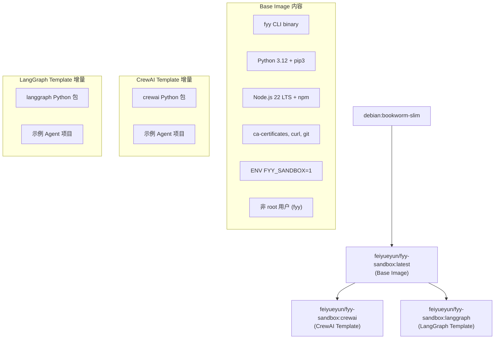
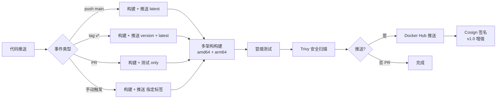
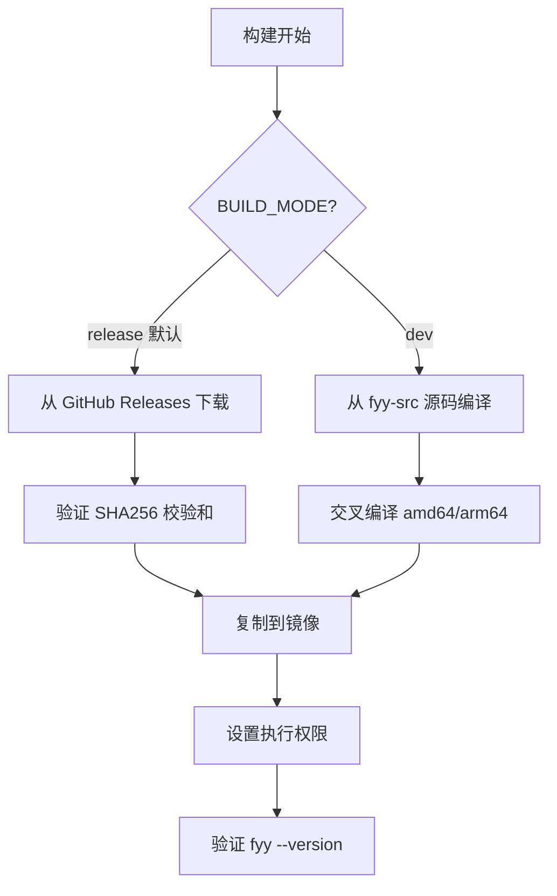
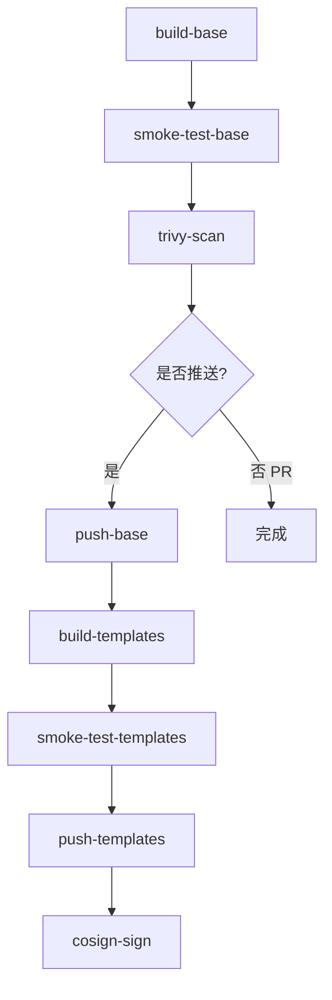

# 设计文档：Agent 沙箱 OCI 镜像（fyy-sandbox-images Phase 1）

## Overview

本设计文档定义 fyy-sandbox-images 仓库的技术架构和实现方案。该仓库是一个独立的公开仓库（BSD 3-Clause），提供飞越云 AI 数字员工平台 Agent Runtime Sandbox（层次一沙箱）的 OCI 标准容器镜像。

### 设计目标

1. 提供最小化、安全的基础 OCI 镜像（Base Image），预装 fyy CLI + Python 3.12 + Node.js 22 LTS
2. 支持 CrewAI 和 LangGraph 两种框架模板镜像，基于 Base Image 构建
3. 实现完整的 CI/CD 流水线：多架构构建 → 冒烟测试 → 安全扫描 → Docker Hub 发布 → 镜像签名
4. 确保镜像兼容 8 种目标沙箱运行时（Docker、Podman、containerd、gVisor 等）

### 仓库结构

```
fyy-sandbox-images/
├── .github/
│   └── workflows/
│       └── build-and-publish.yml    # CI 主工作流
├── base/
│   └── Dockerfile                   # Base Image Dockerfile
├── templates/
│   ├── crewai/
│   │   ├── Dockerfile               # CrewAI 模板镜像 Dockerfile
│   │   └── example-agent/           # CrewAI 示例 Agent 项目
│   │       ├── main.py
│   │       ├── requirements.txt
│   │       ├── skill.json
│   │       └── README.md
│   └── langgraph/
│       ├── Dockerfile               # LangGraph 模板镜像 Dockerfile
│       └── example-agent/           # LangGraph 示例 Agent 项目
│           ├── main.py
│           ├── requirements.txt
│           ├── skill.json
│           └── README.md
├── scripts/
│   ├── smoke-test.sh                # 冒烟测试脚本
│   └── fetch-fyy-binary.sh          # fyy CLI 二进制获取脚本
├── .trivyignore                     # Trivy 误报忽略列表
├── Makefile                         # 本地构建便捷命令
├── CONTRIBUTING.md
├── LICENSE                          # BSD 3-Clause
└── README.md
```

## Architecture

### 镜像层次架构



### CI/CD 流水线架构



### fyy CLI 双模式获取



## Components and Interfaces

### 1. Base Image Dockerfile（`base/Dockerfile`）

多阶段构建设计：

**Stage 1: builder** — 获取和验证 fyy CLI 二进制
- 基于 `debian:bookworm-slim`（与最终镜像一致，避免 glibc 兼容问题）
- 接收构建参数：`FYY_VERSION`、`FYY_BINARY_URL`、`TARGETARCH`
- 发布模式：从 GitHub Releases 下载对应架构的 fyy 二进制，验证 SHA256
- 开发模式：从挂载的源码目录复制预编译二进制

**Stage 2: runtime** — 最终运行时镜像
- 基于 `debian:bookworm-slim`
- 安装运行时依赖：`ca-certificates`、`curl`、`git`、`python3`、`python3-pip`、`python3-venv`、`nodejs`、`npm`
- 创建非 root 用户 `fyy`（UID 1000）
- 复制 fyy CLI 二进制到 `/usr/local/bin/fyy`
- 创建工作目录结构：`~/.feiyueyun/`、`~/.feiyueyun/identity/`、`~/.feiyueyun/tsnet/`
- 设置环境变量：`FYY_SANDBOX=1`
- 配置 HEALTHCHECK：`fyy --version`
- 设置 ENTRYPOINT：`/bin/bash`

**构建参数接口：**

| ARG | 默认值 | 说明 |
|-----|--------|------|
| `FYY_VERSION` | `latest` | fyy CLI 版本号 |
| `FYY_BINARY_URL` | （自动生成） | 自定义二进制下载 URL |
| `TARGETARCH` | （Docker Buildx 自动注入） | 目标架构（amd64/arm64） |

**Node.js 安装策略：**
使用 [NodeSource](https://github.com/nodesource/distributions) 官方 APT 仓库安装 Node.js 22 LTS，确保架构无关且版本可控。

**Python 安装策略：**
使用 Debian bookworm 官方仓库的 `python3` 包（Debian bookworm 默认提供 Python 3.11，需通过 deadsnakes PPA 或直接编译获取 3.12）。考虑到镜像体积和构建复杂度，优先使用 Debian 官方仓库的 Python 3.11，如需严格 3.12 则使用 deadsnakes PPA。

> **设计决策：** Python 版本选择 — 如果 Debian bookworm 官方仓库仅提供 Python 3.11，建议接受 3.11 作为 Phase 1 的 Python 版本（CrewAI 和 LangGraph 均兼容 3.11+），或在 builder stage 中从源码编译 Python 3.12。需求文档指定 3.12，因此设计中保留 3.12 目标，通过 deadsnakes 风格的源码编译或第三方 APT 源实现。

### 2. 框架模板 Dockerfile

**CrewAI 模板（`templates/crewai/Dockerfile`）：**
```dockerfile
FROM feiyueyun/fyy-sandbox:latest
USER root
COPY example-agent/ /home/fyy/example-agent/
RUN pip3 install --no-cache-dir crewai && \
    chown -R fyy:fyy /home/fyy/example-agent/
USER fyy
WORKDIR /home/fyy/example-agent
```

**LangGraph 模板（`templates/langgraph/Dockerfile`）：**
```dockerfile
FROM feiyueyun/fyy-sandbox:latest
USER root
COPY example-agent/ /home/fyy/example-agent/
RUN pip3 install --no-cache-dir langgraph && \
    chown -R fyy:fyy /home/fyy/example-agent/
USER fyy
WORKDIR /home/fyy/example-agent
```

### 3. fyy CLI 二进制获取脚本（`scripts/fetch-fyy-binary.sh`）

接口：
```bash
# 发布模式（默认）
./scripts/fetch-fyy-binary.sh --version v1.0.0 --arch amd64 --output ./fyy

# 开发模式
./scripts/fetch-fyy-binary.sh --mode dev --source /path/to/fyy-src --arch arm64 --output ./fyy
```

参数：
| 参数 | 必需 | 默认值 | 说明 |
|------|------|--------|------|
| `--version` | 发布模式必需 | — | fyy CLI 版本号 |
| `--arch` | 是 | — | 目标架构（amd64/arm64） |
| `--output` | 是 | — | 输出文件路径 |
| `--mode` | 否 | `release` | 获取模式（release/dev） |
| `--source` | dev 模式必需 | — | fyy-src 仓库路径 |
| `--url` | 否 | （自动生成） | 自定义下载 URL |

行为：
- 发布模式：构造 GitHub Releases URL → 下载二进制 → 下载 SHA256 校验文件 → 验证校验和 → 设置执行权限
- 开发模式：从指定源码路径编译或复制预编译二进制
- 失败时输出明确错误信息（URL、HTTP 状态码或编译错误）并以非零退出码退出

### 4. 冒烟测试脚本（`scripts/smoke-test.sh`）

接口：
```bash
# 测试 Base Image
./scripts/smoke-test.sh --image feiyueyun/fyy-sandbox:latest --type base

# 测试框架模板镜像
./scripts/smoke-test.sh --image feiyueyun/fyy-sandbox:crewai --type crewai
./scripts/smoke-test.sh --image feiyueyun/fyy-sandbox:langgraph --type langgraph
```

测试项（Base Image）：
1. 容器启动验证（`docker run` 退出码 0）
2. fyy CLI 可执行（`fyy --version` 退出码 0，输出包含版本号）
3. Python 运行时可用（`python3 --version` 输出包含 `3.12`）
4. Node.js 运行时可用（`node --version` 输出包含 `v22`）
5. pip3 可用（`pip3 --version` 退出码 0）
6. npm 可用（`npm --version` 退出码 0）
7. 环境变量 `FYY_SANDBOX=1`
8. 非 root 用户运行（`whoami` ≠ `root`）
9. fyy CLI 工作目录存在（`~/.feiyueyun/` 及子目录）
10. 系统工具可用（`ca-certificates`、`curl`、`git`）

额外测试项（框架模板）：
- CrewAI：`python3 -c "import crewai"` 退出码 0，`/home/fyy/example-agent/` 目录完整
- LangGraph：`python3 -c "import langgraph"` 退出码 0，`/home/fyy/example-agent/` 目录完整

不变量验证（REQ-16）：
- fyy CLI 版本一致性：`fyy --version` 输出与 `FYY_VERSION` 构建参数一致
- 框架模板继承完整性：模板镜像中 `fyy --version`、`python3 --version`、`node --version` 与 Base Image 一致
- 环境变量持久性：`FYY_SANDBOX=1` 始终存在
- 非 root 用户约束：UID ≠ 0 且 `~/.feiyueyun/` 可读写

### 5. GitHub Actions 工作流（`.github/workflows/build-and-publish.yml`）

触发条件：
- `push` 到 `main` 分支
- `pull_request` 到 `main` 分支
- `workflow_dispatch`（手动触发，参数：`fyy_version`、`image_tag`、`trivy_severity`）
- `push` 标签 `v*`

Jobs 设计：



| Job | 说明 | 运行条件 |
|-----|------|---------|
| `build-base` | 多架构构建 Base Image | 始终 |
| `smoke-test-base` | Base Image 冒烟测试 | 始终 |
| `trivy-scan` | Trivy 安全扫描 | 始终 |
| `push-base` | 推送 Base Image 到 Docker Hub | 非 PR |
| `build-templates` | 构建框架模板镜像 | 非 PR |
| `smoke-test-templates` | 模板镜像冒烟测试 | 非 PR |
| `push-templates` | 推送模板镜像到 Docker Hub | 非 PR |
| `cosign-sign` | Cosign keyless 签名 | 非 PR + v1.0 启用 |

GitHub Secrets：
- `DOCKERHUB_USERNAME`：Docker Hub 用户名
- `DOCKERHUB_TOKEN`：Docker Hub 访问令牌

GitHub Actions 权限：
- `contents: read`
- `packages: write`（如需 GHCR）
- `id-token: write`（Cosign OIDC keyless 签名）
- `security-events: write`（Trivy SARIF 上传）


## Data Models

### OCI Image Labels

所有镜像构建时注入以下 OCI 标准标签：

| Label | 值 | 说明 |
|-------|-----|------|
| `org.opencontainers.image.version` | `${FYY_VERSION}` | fyy CLI 版本号 |
| `org.opencontainers.image.source` | `https://github.com/feiyueyun/fyy-sandbox-images` | 源码仓库 |
| `org.opencontainers.image.created` | `${BUILD_TIMESTAMP}` | 构建时间（RFC 3339） |
| `org.opencontainers.image.description` | `FYY Agent Sandbox - Pre-installed fyy CLI OCI image` | 镜像描述 |
| `org.opencontainers.image.licenses` | `BSD-3-Clause` | 许可证 |
| `org.opencontainers.image.title` | `fyy-sandbox` | 镜像标题 |
| `org.opencontainers.image.vendor` | `Feiyueyun` | 供应商 |

### 镜像标签策略

| 标签格式 | 示例 | 触发条件 | 说明 |
|----------|------|---------|------|
| `latest` | `feiyueyun/fyy-sandbox:latest` | push main / tag v* | Base Image 最新稳定版 |
| `v{X.Y.Z}` | `feiyueyun/fyy-sandbox:v1.0.0` | tag v* | Base Image 指定版本 |
| `{framework}` | `feiyueyun/fyy-sandbox:crewai` | push main / tag v* | 框架模板最新版 |
| `{framework}-v{X.Y.Z}` | `feiyueyun/fyy-sandbox:crewai-v1.0.0` | tag v* | 框架模板指定版本 |

### 示例 Agent 项目 skill.json 结构

遵循 Skill_Manifest 标准（skill-manifest-spec）：

```json
{
  "name": "example-crewai-agent",
  "version": "0.1.0",
  "description": "Example CrewAI agent for FYY sandbox",
  "type": "agent",
  "runtime": {
    "language": "python",
    "version": ">=3.11"
  },
  "entry": "main.py",
  "skills": [],
  "tags": ["example", "crewai"]
}
```

### 构建参数模型

| 参数 | 类型 | 默认值 | 说明 |
|------|------|--------|------|
| `FYY_VERSION` | string | `latest` | fyy CLI 版本号 |
| `FYY_BINARY_URL` | string | 自动生成 | 自定义二进制下载 URL |
| `BUILD_MODE` | enum | `release` | 构建模式（release/dev） |
| `TARGETARCH` | string | 自动注入 | 目标架构 |
| `PYTHON_VERSION` | string | `3.12` | Python 版本 |
| `NODE_MAJOR` | string | `22` | Node.js 主版本号 |

### Trivy 扫描配置

`.trivyignore` 文件格式：
```
# 已知误报或已接受风险
CVE-YYYY-NNNNN
```

Trivy 扫描参数：
- `--severity`：默认 `CRITICAL,HIGH`，可通过 `TRIVY_SEVERITY` 覆盖
- `--format`：`sarif`（用于 GitHub Security 面板）+ `table`（用于 CI 日志）
- `--exit-code`：`0`（不阻塞构建，仅报告）
- `--vuln-type`：`os,library`

### 用户和权限模型

| 用户 | UID | GID | 主目录 | 说明 |
|------|-----|-----|--------|------|
| `fyy` | 1000 | 1000 | `/home/fyy` | 默认运行用户 |

目录权限：
- `/home/fyy/.feiyueyun/` — `fyy:fyy 755`
- `/home/fyy/.feiyueyun/identity/` — `fyy:fyy 700`（敏感数据）
- `/home/fyy/.feiyueyun/tsnet/` — `fyy:fyy 755`
- `/usr/local/bin/fyy` — `root:root 755`（所有用户可执行）

## Correctness Properties

*A property is a characteristic or behavior that should hold true across all valid executions of a system — essentially, a formal statement about what the system should do. Properties serve as the bridge between human-readable specifications and machine-verifiable correctness guarantees.*


### Property 1: SHA256 校验和验证正确性

*For any* binary content and its corresponding SHA256 hash, the fetch script's checksum verification function SHALL accept the binary when the hash matches and reject it when the hash does not match.

**Validates: Requirements 2.5**

### Property 2: 二进制获取失败时的错误报告

*For any* failed download scenario (HTTP 404, 500, network timeout, corrupt response), the fetch script SHALL exit with a non-zero exit code and output an error message containing the attempted URL and the failure reason (HTTP status code or error description).

**Validates: Requirements 2.8**

### Property 3: 镜像标签与版本号对齐

*For any* valid semantic version string used as `FYY_VERSION` build argument, the CI pipeline SHALL generate image tags that contain the exact version string (e.g., `FYY_VERSION=1.0.0` produces tag `v1.0.0`).

**Validates: Requirements 7.1**

### Property 4: OCI 标准标签完整性

*For any* valid set of build parameters (version, timestamp, source URL), the built image SHALL contain all required OCI labels (`org.opencontainers.image.version`, `org.opencontainers.image.source`, `org.opencontainers.image.created`, `org.opencontainers.image.description`, `org.opencontainers.image.licenses`) with correctly formatted values.

**Validates: Requirements 7.5**

### Property 5: fyy CLI 版本一致性

*For any* valid `FYY_VERSION` build argument, the `fyy --version` output inside the built image SHALL contain the exact version string specified by `FYY_VERSION`.

**Validates: Requirements 16.1**

### Property 6: 框架模板继承完整性

*For any* Framework_Template_Image (crewai, langgraph), the outputs of `fyy --version`, `python3 --version`, and `node --version` SHALL be identical to the corresponding outputs in the Base_Image it was built from.

**Validates: Requirements 16.2**

### Property 7: 环境变量持久性

*For any* sequence of user commands executed in the container (including shell scripts, Python scripts, and Node.js scripts), the environment variable `FYY_SANDBOX` SHALL remain set to `1`.

**Validates: Requirements 16.3**

### Property 8: 非 root 用户约束

*For any* container started from the Base_Image or Framework_Template_Image with default settings, the default process UID SHALL not be 0 (non-root), and the `~/.feiyueyun/` directory SHALL be readable and writable by the default user.

**Validates: Requirements 16.4**

### Property 9: 构建幂等性

*For any* identical set of build parameters (`FYY_VERSION`, base image digest), two consecutive builds SHALL produce images with identical filesystem layer content (excluding build timestamps and OCI metadata).

**Validates: Requirements 16.5**

### Property 10: 多架构功能一致性

*For any* smoke test item (fyy CLI executable, Python available, Node.js available, environment variables correct), the test result on linux/amd64 SHALL be identical to the test result on linux/arm64.

**Validates: Requirements 16.6**

## Error Handling

### 构建阶段错误处理

| 错误场景 | 处理方式 | 用户可见信息 |
|----------|---------|-------------|
| fyy 二进制下载失败（HTTP 4xx/5xx） | 终止构建，退出码 1 | URL、HTTP 状态码、重试建议 |
| fyy 二进制 SHA256 校验失败 | 终止构建，退出码 1 | 期望校验和 vs 实际校验和 |
| fyy-src 编译失败（dev 模式） | 终止构建，退出码 1 | 编译错误日志 |
| Python/Node.js 安装失败 | 终止构建，退出码 1 | APT 错误日志 |
| Docker Buildx 多架构构建失败 | 终止构建 | 失败的架构和错误详情 |

### CI 流水线错误处理

| 错误场景 | 处理方式 | 影响范围 |
|----------|---------|---------|
| 冒烟测试失败 | 终止后续步骤 | 不推送镜像 |
| Trivy 发现 CRITICAL/HIGH 漏洞 | 上传 SARIF artifact，继续构建 | 不阻塞发布（仅报告） |
| Docker Hub 推送失败 | 终止，输出 digest 验证错误 | 镜像不可用 |
| Cosign 签名失败 | 记录错误日志，继续 | 镜像可用但未签名 |
| GitHub Secrets 缺失 | 终止推送步骤 | PR 构建不受影响 |

### 运行时错误处理

| 错误场景 | 处理方式 |
|----------|---------|
| fyy CLI 控制平面不可达 | CLI 进入降级模式，使用本地缓存 |
| 框架模板依赖安装失败 | 容器启动成功，用户手动排查依赖问题 |
| 非 root 用户权限不足 | 工作目录预设正确权限，避免运行时权限错误 |

## Testing Strategy

### 测试层次

本项目的测试策略分为三个层次：

#### 1. 冒烟测试（Smoke Tests）— 主要测试手段

冒烟测试是本项目最核心的测试方式，覆盖 REQ-1、REQ-8、REQ-9、REQ-10、REQ-11 的大部分验收标准。

实现方式：`scripts/smoke-test.sh` shell 脚本，在 CI 中对每个构建的镜像执行。

测试项覆盖：
- 容器启动验证
- fyy CLI 可执行性和版本号
- Python 3.12 / Node.js 22 LTS 运行时
- pip3 / npm 包管理器
- 环境变量 FYY_SANDBOX=1
- 非 root 用户运行
- 工作目录结构
- 系统工具（ca-certificates、curl、git）
- 框架模板特有验证（CrewAI/LangGraph 可导入、示例项目完整）

#### 2. 属性测试（Property-Based Tests）

本项目适合属性测试的场景有限，主要集中在：

- **fetch 脚本的 SHA256 校验逻辑**（Property 1）：纯函数，输入空间大（任意二进制内容 + 校验和）
- **fetch 脚本的错误处理**（Property 2）：多种失败模式的正确报告
- **镜像构建不变量**（Properties 5-10）：跨构建参数、跨架构的一致性验证

属性测试工具选择：由于本项目主要是 shell 脚本和 Dockerfile，属性测试将使用 shell 脚本 + 参数化测试的方式实现，而非传统的 PBT 库。对于 SHA256 校验逻辑，可以提取为独立函数并使用参数化测试验证。

对于 Properties 5-10（镜像构建不变量），这些属性在 CI 冒烟测试中通过参数化验证实现：
- 版本一致性：冒烟测试中比较 `fyy --version` 输出与 `FYY_VERSION` 构建参数
- 模板继承：冒烟测试中比较模板镜像与基础镜像的运行时版本
- 环境变量持久性：冒烟测试中在多种上下文中检查 `FYY_SANDBOX`
- 非 root 约束：冒烟测试中验证 UID 和目录权限
- 多架构一致性：CI 中在两种架构上运行相同冒烟测试并比较结果

每个属性测试最少运行 100 次迭代（适用于 SHA256 校验等纯函数测试）。

Tag 格式：`Feature: fyy-sandbox-images-phase1, Property {number}: {property_text}`

#### 3. 集成测试（Integration Tests）

集成测试覆盖需要外部服务或完整 CI 环境的场景：

- Docker Hub 推送和 digest 验证（REQ-12）
- Cosign 签名和验证（REQ-6）
- 多架构 manifest list 验证（REQ-3）
- fyy CLI 控制平面连接（REQ-14）
- 端到端 Agent 项目运行（REQ-15）

集成测试在 CI 流水线中作为独立 job 执行，不阻塞冒烟测试。

### 不使用属性测试的场景

以下场景不适合属性测试，使用冒烟测试或集成测试替代：

- **Dockerfile 结构验证**（REQ-1.7 多阶段构建）：静态分析，不是运行时行为
- **CI 工作流配置**（REQ-4 触发条件、步骤顺序）：YAML 配置验证
- **文档完整性**（REQ-13）：文件存在性检查
- **Docker Hub 配置**（REQ-12）：外部服务配置
- **Trivy 扫描行为**（REQ-5）：第三方工具行为

### 测试执行矩阵

| 测试类型 | 执行时机 | 阻塞发布 | 覆盖 REQ |
|----------|---------|---------|---------|
| 冒烟测试（Base Image） | 每次构建 | 是 | 1, 8, 9, 16 |
| 冒烟测试（模板镜像） | 非 PR 构建 | 是 | 10, 11, 16 |
| Trivy 安全扫描 | 每次构建 | 否（仅报告） | 5 |
| 属性测试（SHA256 校验） | 每次构建 | 是 | 2 |
| 集成测试（Docker Hub） | 非 PR 构建 | 是 | 12 |
| 集成测试（Cosign） | v1.0 标签构建 | 否 | 6 |
| 多架构一致性测试 | 每次构建 | 是 | 3, 16 |
